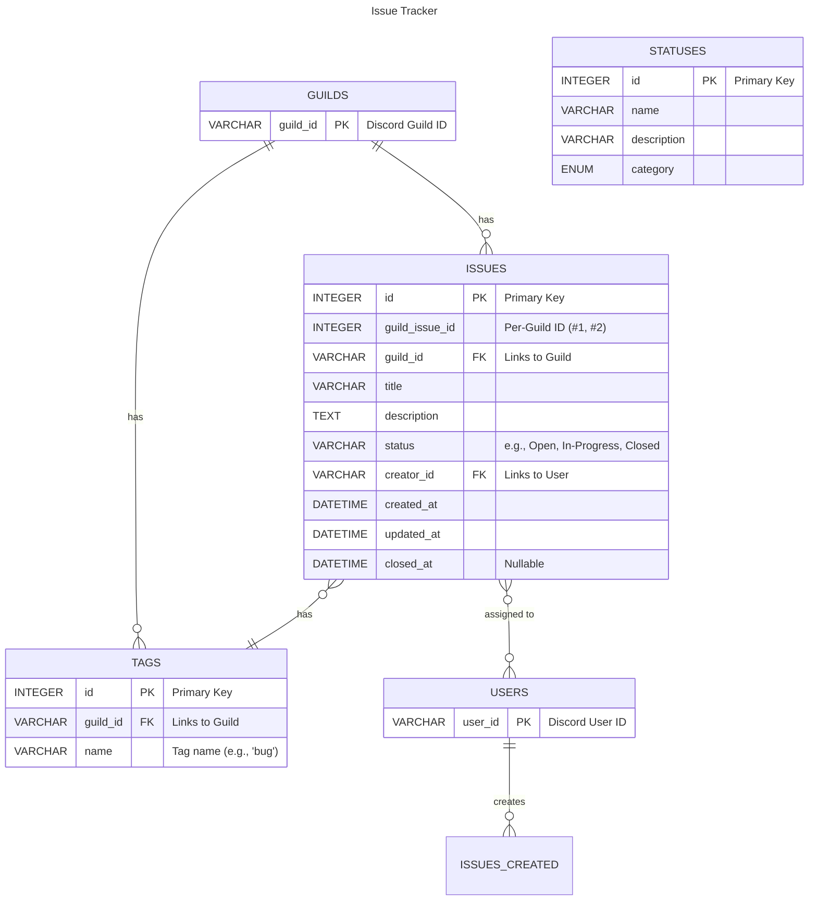

# Discord Issue Tracker

Discord is a common place for small and young teams to communicate with each other for software development. Unfortunately, most issue trackers/project managers are geared towards software developers, and are complicated for non-developers to use.

External issue trackers like Trello are simpler for non-developers, but I found that immature non-developers often forget about these external issue trackers. The motive of this project is to integrate an issue tracker into Discord, allowing you to assign users issues and query.

## Technology

| Tool       | Rationale                                 |
| ---------- | ----------------------------------------- |
| Python     | Lends itself to clean, maintainable code. |
| discord.py | Most mature Discord bot API wrapper       |
| sqlite3    | Simple setup, excels in small programs    |
| SQLAlchemy | Most mature ORM in Python                 |
| Docker     | Allows for easy deployment                |

## Application Commands

### Issues

#### `create`

Creates a new issue in the tracker. This is the primary command for reporting bugs or suggesting features.

**Syntax:** `/issue create <title> [description] [assignee] [tags]`
- **`title`** (Required String): A short, descriptive title for the issue.
- **`description`** (Optional String): A more detailed explanation of the issue. Users can provide steps to reproduce, context, or any relevant information.
- **`assignee`** (Optional User): The team member you want to assign the issue to. You can @mention the user here.
- **`tags`** (Optional String): A comma-separated list of tags to categorize the issue (e.g., "bug, UI, high-priority").

#### `view`

Displays the full details of a single issue, including its title, description, status, assignee, and tags.

**Syntax**: `/issue view <id>`
- **`id`** (Required Integer): The unique ID number of the issue you want to view.

#### `list`

Shows a list of all currently open issues. This command includes optional filters to help users find specific tasks.

**Syntax**: `/issue list [assignee] [status] [tag]`
- **`assignee`** (Optional User): Filters the list to show only issues assigned to a specific member.
- **`status`** (Optional String): Filters by status. For example, you could filter for "open", "in-progress", or "resolved".
- **`tag`** (Optional String): Filters the list to show only issues that include a specific tag.

**Output:** Issues in a tabular form with issue number, title, status, assignees, tags.

#### `edit`

Allows a user to modify the details of an existing issue.

**Syntax**: `/issue edit <id> [title] [description]`
- **`id`** (Required Integer): The ID of the issue to be modified.
- **`title`** (Optional String): A new title for the issue.
- **`description`** (Optional String): A new description for the issue.

#### `assign`

Assigns or re-assigns an issue to a different user.

**Syntax**: `/issue assign <id> <user>`
- **`id`** (Required Integer): The ID of the issue to be assigned.
- **`user`** (Required User): The member to assign the issue to.

#### `unassign`
Remove user from assignment.

**Syntax:** `/issue unassign <id> <user>`
- **`id`** (Required Integer): The ID of the issue.
- **`user`** (Required User): Member that is assigned to the issue.

#### `close`

Closes an issue, typically when the bug has been fixed or the feature has been implemented. This marks the task as complete.

**Syntax**: `/issue close <id> [reason]`
- **`id`** (Required Integer): The ID of the issue to close.
- **`reason`** (Optional String): A brief comment about the resolution (e.g., "Fixed in patch 1.1.2").

### Tags

#### `create`

Create a tag.

**Syntax:** `/tag create <name>`
- `name` (Required String): Name of tag.

#### `delete`

Delete a tag. Removes tag from issue if existing.

**Syntax:** `/tag delete <name>`
- `name` (Required String): Name of tag to remove.

#### `list`

List all tags.

**Syntax:** `/tag list`

## Database Design

Guilds and Users are tables to facilitate future additions to their tables (e.g. guilds have specific channels that the bot can post in).
